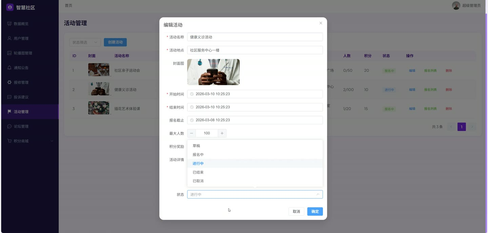
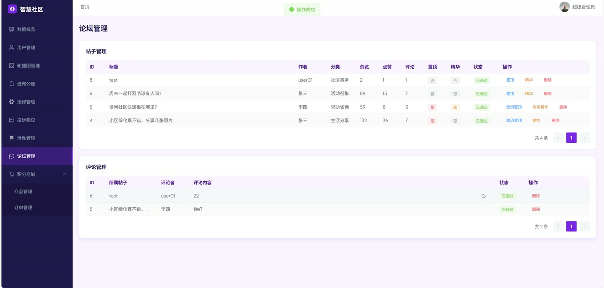
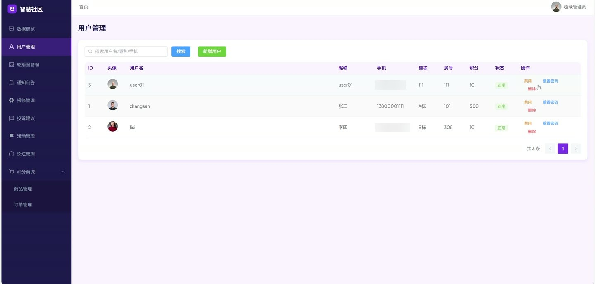

# (附文档)Springboot3+Vue3+MySQL 社区管理服务平台

**技术栈**：Springboot3、Vue3、MySQL

### 系统简介

社区管理服务平台基于 Spring Boot 3 + Vue 3 前后端分离架构，围绕社区日常管理场景，为普通居民、物业管理员、维修工人三类角色提供数字化服务。系统涵盖社区活动报名与签到、报修工单流转、投诉建议处理、论坛交流、积分商城兑换、AI 智能助手问答、通知公告发布、轮播图管理、用户管理、管理员权限管理等核心业务模块，后端采用 MyBatis-Plus 操作 MySQL，前端使用 Vue 3 + Element Plus 构建管理后台与用户端界面。
 
### 核心功能
 
### 普通用户端

 
- 用户注册与登录：通过用户名/密码注册账号，登录后获取 JWT Token 并进入系统。 
- 查看个人资料与修改信息：在个人中心查看头像、昵称、手机号、积分余额，支持修改个人资料。 
- 修改登录密码：输入旧密码与新密码完成密码变更。 
- 浏览社区活动列表：按时间倒序展示所有可报名活动（进行中/已结束/已取消），支持分页查看。 
- 查看活动详情与报名状态：进入活动详情页可查看时间、地点、奖励积分、当前报名人数，并显示当前用户是否已报名。 
- 报名与取消报名：在活动报名截止前且未满员时点击“立即报名”；已报名未签到时可取消报名，已签到则不可取消。 
- 查看我的已报名活动：分页展示当前用户所有已报名（含已签到）的活动列表。 
- 提交报修工单：填写报修标题、问题描述、报修位置、问题类别（水电/门窗/电梯等），可上传现场照片。 
- 查看我的报修工单：分页查看自己提交的工单列表，跟踪“待处理/处理中/已完成/已关闭”状态。 
- 提交投诉建议：选择类型（投诉/建议），填写标题、详细内容，可上传图片。 
- 查看我的投诉记录：分页查看已提交的投诉建议，查看管理员回复内容。 
- 浏览论坛帖子列表：按时间倒序展示所有已审核通过的帖子，支持分页。 
- 查看帖子详情与互动：进入帖子详情页可阅读内容、查看评论列表，支持点赞与发表评论。 
- 发布帖子：填写标题、内容、分类，可上传图片，发布后自动进入已审核状态。 
- 管理我的帖子：分页查看自己发布的帖子，支持删除操作。 
- 浏览积分商城商品：分页展示可兑换的积分商品（名称、所需积分、库存、图片）。 
- 兑换积分商品：选择商品点击“立即兑换”，扣除相应积分并生成兑换订单。 
- 查看我的兑换订单：分页查看积分兑换记录及订单状态（待核销/已核销/已取消）。 
- 查看积分流水明细：分页展示积分变动记录（来源/用途、变动数值、时间）。 
- AI 智能助手问答：在聊天界面发送消息，系统优先匹配模板问答（报修/活动/积分/投诉/公告/论坛操作指引），未命中则调用百度千帆大模型 AI 回复。 
- 查看聊天历史与清空：按时间升序展示最近 50 条对话记录，支持一键清空所有聊天记录。 
- 查看通知公告：分页浏览社区发布的公告列表，点击标题查看公告全文。 
- 查看首页轮播图：获取启用的轮播图列表并在首页展示。
 
### 管理员端

 
- 管理员登录与信息查看：使用用户名/密码登录，获取当前管理员个人信息（脱敏密码）。 
- 管理员列表管理：分页查看所有管理员账号，支持按用户名/昵称搜索。 
- 新增管理员：填写用户名、密码、昵称、角色等信息，校验用户名唯一性。 
- 编辑与删除管理员：修改管理员信息（密码可选留空），支持逻辑删除。 
- 用户列表管理：分页查看所有注册用户，支持按用户名/昵称/手机号搜索。 
- 管理用户状态：启用或禁用用户账号。 
- 重置用户密码：将指定用户的密码重置为默认值。 
- 删除用户：逻辑删除指定用户账号。 
- 新增用户：管理员手动为居民注册账号。 
- 活动管理：分页查看所有活动，支持按状态（待报名/进行中/已结束/已取消）筛选。 
- 新增活动：填写活动标题、描述、封面图、地点、开始/结束时间、报名截止时间、最大参与人数、奖励积分。 
- 编辑与删除活动：修改活动信息，支持逻辑删除。 
- 查看活动报名列表：查看指定活动的所有报名记录（用户姓名、电话、签到状态、是否已发放积分）。 
- 签到操作：对已报名的用户进行现场签到，记录签到时间。 
- 批量发放积分：为已签到但未发放积分的参与者统一发放活动奖励积分，并生成积分流水记录。 
- 报修工单管理：分页查看所有报修工单列表。 
- 派单处理：选择维修人员并指派工单，工单状态变为“处理中”。 
- 完成工单：填写维修结果和结果图片，将工单标记为“已完成”。 
- 关闭工单：将指定工单直接关闭。 
- 维修人员管理：分页查看所有维修人员，支持按姓名/电话搜索。 
- 新增维修人员：填写用户名、姓名、电话、头像等信息，校验用户名唯一。 
- 编辑与删除维修人员：修改信息，支持逻辑删除。 
- 启用/禁用维修人员：切换维修人员的账号启用状态。 
- 重置维修人员密码：将指定维修人员的密码重置为默认值。 
- 获取启用维修人员列表：用于派单下拉选择。 
- 投诉建议管理：分页查看所有投诉建议，支持按状态（待回复/已回复/已关闭）、类型（投诉/建议）、关键词搜索。 
- 回复投诉：填写回复内容后提交，投诉状态变为“已回复”，记录回复管理员与回复时间。 
- 关闭投诉：将指定投诉直接关闭。 
- 论坛帖子管理：分页查看所有帖子（含未审核），支持审核通过/驳回。 
- 置顶/取消置顶帖子：切换帖子的置顶状态。 
- 精华/取消精华帖子：切换帖子的精华状态。 
- 删除帖子：管理员强制删除违规帖子。 
- 论坛评论管理：分页查看所有评论，支持审核通过/驳回，支持强制删除评论。 
- 通知公告管理：分页查看公告列表，支持按标题关键词、状态筛选。 
- 新增公告：填写标题、内容、封面图、类型（普通通知/政策文件/紧急通知）、发布状态。 
- 编辑与删除公告：修改公告内容，支持逻辑删除。 
- 轮播图管理：分页查看轮播图列表，支持新增、编辑、删除轮播图（标题、图片、链接、排序、启用状态）。 
- 积分商品管理：分页查看积分商城商品列表。 
- 新增积分商品：填写商品名称、所需积分、库存数量、商品图片等。 
- 编辑与删除积分商品：修改商品信息，支持逻辑删除。 
- 兑换订单管理：分页查看所有积分兑换订单。 
- 核销订单：管理员确认兑换订单已领取，标记为“已核销”。 
- 取消订单：将指定兑换订单取消并退还积分。 
- 数据统计概览：查看总用户数、总活动数、总报修数、总投诉数等核心指标。 
- 报修分类统计：按水电、门窗、电梯、公共设施等类别统计报修工单数量。 
- 报修状态统计：统计待处理、处理中、已完成、已关闭的工单数量。 
- 投诉类型统计：按投诉、建议分类统计数量。 
- 活动参与统计：统计各活动的报名人数。 
- 用户趋势统计：按日期统计新增用户数量。 
- 积分统计：统计总发放积分、总消耗积分等数据。 
- 文件上传：支持上传图片/文件，按日期目录存储，返回可访问 URL。
 
### 维修人员端

 
- 维修人员登录：使用用户名/密码登录，获取 JWT Token 和人员信息。 
- 查看个人信息与修改资料：查看头像、姓名、电话等，支持更新电话和头像。 
- 修改登录密码：输入旧密码与新密码完成密码变更。 
- 查看工单统计：获取待处理、处理中、已完成三种状态的工单数量。 
- 分页查询我的工单：按状态筛选查看分配给自己的工单列表。 
- 查看工单详情：查看工单的完整信息（报修内容、位置、图片、用户信息等）。 
- 开始处理工单：确认接单，将工单状态从“待处理”变为“处理中”。 
- 完成维修：填写维修结果描述和结果图片，将工单标记为“已完成”。
 
### 技术栈

 后端框架Spring Boot 3.x ORMMyBatis-Plus 3.x 权限认证JWT (jjwt) 前端框架Vue 3 (Composition API) 状态管理Pinia 构建工具Vite UI 组件库Element Plus 数据库MySQL 8.x AI 集成百度千帆大模型 API (OpenAI 兼容格式)
 
### 交付内容

 
- 后端完整源码 
- 前端完整源码 
- 数据库初始化脚本 
- 万字文档

## 界面展示

---

## 获取完整源码 + 万字文档

本仓库为项目介绍页。**完整前后端源码、数据库初始化脚本、万字项目文档**，请加微信 `kangkangcode`，或访问 [codekk.top](http://codekk.top) 获取。

可作课程设计 / 毕业设计参考，支持远程部署调试。